

   

## SEGURO AUTO é uma aplicação fictícia para usuários finais solicitarem o [sinistro](https://www.minutoseguros.com.br/perguntas-frequentes/seguro-auto/o-que-e-um-sinistro) de um veículo específico. Esse desafio foi proposto pela empresa [EY - Brasil](https://www.ey.com/pt_br). 

**Status do Projeto:** _Concluído_ 
   
** Previsto possíveis modificações para o site **

**Deploy:** [EY - Seguro Auto](https://ey---cadastro-de-sinistro.firebaseapp.com/)

 

**USUÁRIOS DE TESTE:**
  **Email 1:** juan@teste.com
   
  **Email 2:** olivia@teste.com
   
  **Senha:** 123456
     

---

## Índice

- [1. Introdução](#1-introdução)
- [2. Resumo do Projeto](#2-resumo-do-projeto)
- [3. Implementações Futuras do Projeto](#3-implementações-futuras-do-projeto)
- [4. Fluxogramas](#4-fluxogramas)
- [5. Protótipo e testes de usabilidade](#5-protótipo-e-testes-de-usabilidade)
- [6. Aprendizados](#6-aprendizados)
  - [6.1 Tecnologias e Ferramentas Utilizadas](#61-tecnologias-e-ferramentas-utilizadas)
- [7. Desenvolvedoras do Projeto](#7-desenvolvedoras-do-projeto)

## 1. INTRODUÇÃO

Projeto desenvolvido no bootcamp de front-end da Laboratoria para o evento denominado Talent Fest. Nosso desafio foi proposto pela empresa EY e neste projeto desenvolvemos uma aplicação web na modalidade desktop _responsivo_ (_mobile_) que ofereça aos clientes de uma seguradora de automóveis, uma alternativa fácil e rápida para abertura de sinistros.
Neste desafio tivemos que criar um banco de dados de back-end do zero e para isso optamos por depositar as coleções do nosso banco de dados no FireStore do Google Firebase, um BaaS (back-end as service).

## 2. RESUMO DO PROJETO

O aplicativo da EY Seguros oferece uma forma rápida e fácil para gerenciar/criar sinistros. Nele é possível que o cliente acesse seu histórico e efetue a criação de um sinistro. Para que o cliente consiga realizar a abertura de um sinistro é necessário que preencha o formulário, acrescente uma foto do veículo e aceite os termos e condições da seguradora.
Neste desafio, para iniciar a criação da aplicação, foram fornecidas três histórias de usuário:

### 2.1 Caminho Feliz (História de Usuário 1)
   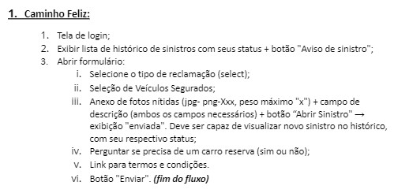

### 2.2 Caminho Infeliz 1 (História de Usuário 2)
   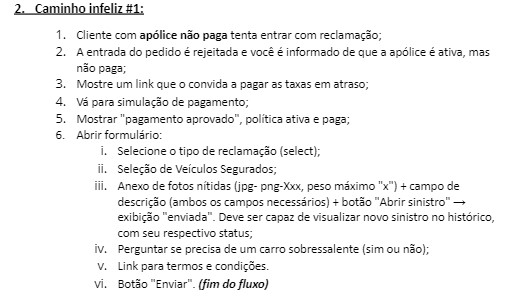

### 2.3 Caminho Infeliz 2 (História de Usuário 3)
   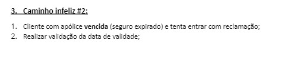
   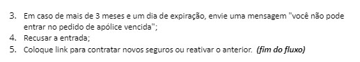

## 3. IMPLEMENTAÇÕES FUTURAS DO PROJETO

Para as futuras implementações, iremos aprimorar a segurança de nossos usuários seguindo as determinações legais contidas na Lei Geral de Proteção de Dados Pessoais(LGPD). Também serão implementadas melhorias de acessibilidade usando tecnologias externas existentes. Por fim, a _*[PESQUISA DE USUÁRIOS](https://docs.google.com/forms/d/e/1FAIpQLSeiVY99B4Z_S7eQhYpNtOCx5lCFf1kwg6RUugQ7jcXlfO2I0g/viewform?usp=sf_link)*_ indicou que a aplicação deve implementar um canal de atendimento por chat para facilitar a comunicação deles com a seguradora. 

Uma situação hipotética apontada para a abertura de um _*[sinistro](https://www.minutoseguros.com.br/perguntas-frequentes/seguro-auto/o-que-e-um-sinistro)*_. Imagine você, usuário, localizado no meio de uma BR, sem sinal de wi-fi, precisando solicitar um reboque (que a sua seguradora oferece) para o seu carro que colidiu com outro. O usuário, no momento de um desespero, precisa de uma aplicação que lhe facilite o contato com o seu prestador de serviços independente do meio utilizado. Desta forma, pensando em aprimorar a experiência de nossos usuários bem como facilitar o contato entre prestador de serviços e cliente decidimos disponibilizar, em todo o ambiente da aplicação, os canais de atendimento telefônico da empresa. 

* Pensando em aprimorar a experiência do usuário, foi criada uma Proto Persona com as seguintes características:

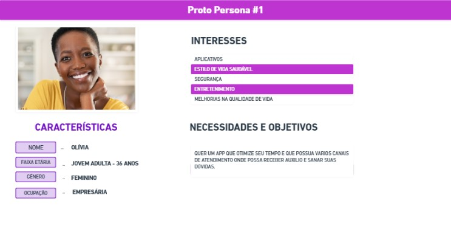

* Os resultados obtidos com a pesquisa de usuário, obteve a participação de 20 pessoas e forneceu os seguintes resultados:

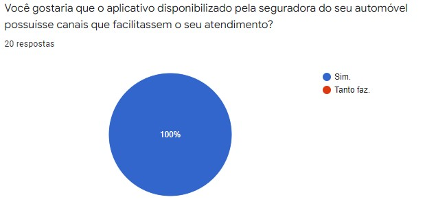

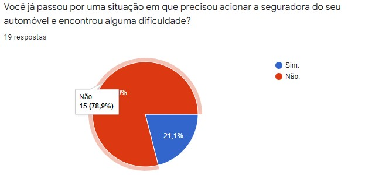

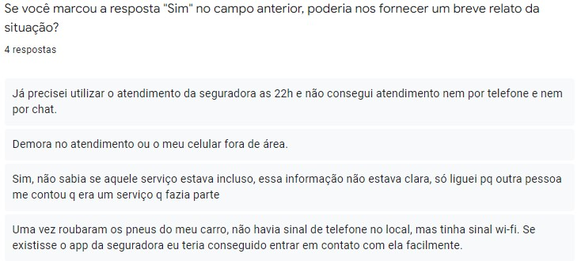

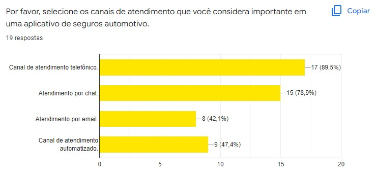

* Através da pesquisa de usuário realizada foi criada uma história de usuário:

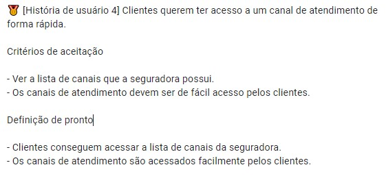

## 4. FLUXOGRAMAS

* Com base nas historias de usuário nós criamos os seguintes fluxogramas.

## 5. PROTÓTIPO E TESTES DE USABILIDADE

* Visualizamos uma aplicação que refletisse as cores marcantes da EY e tentamos replicar a mesma fonte utilizada por ela em suas aplicações e websites para tornar a experiência mais imersiva.

## 5.1 PRIMEIRA HISTÓRIA DE USUÁRIO
  1. Tela de login;
  2. Exibir lista de histórico de sinistros com seus status + botão "Aviso de sinistro";
  3. Abrir formulário:
      * Selecione o tipo de reclamação (select);
      * Seleção de Veículos Segurados;
      * Anexo de fotos nítidas (jpg- png-Xxx, peso máximo "x") + campo de descrição (ambos os campos necessários) + botão “Abrir Sinistro" → exibição "enviada". Deve ser capaz de visualizar novo sinistro no histórico, com seu respectivo status;
      * Perguntar se precisa de um carro reserva (sim ou não);
      * Link para termos e condições.
      * Botão "Enviar". (fim do fluxo)

## 5.2 SEGUNDA HISTÓRIA DE USUÁRIO
  1. Cliente com apólice não paga tenta entrar com reclamação;
  2. A entrada do pedido é rejeitada e você é informado de que a apólice é ativa, mas
não paga;
  3. Mostre um link que o convida a pagar as taxas em atraso;
  4. Vá para simulação de pagamento;
  5. Mostrar "pagamento aprovado", política ativa e paga;
  6. Abrir formulário:
      * Selecione o tipo de reclamação (select);
      * Seleção de Veículos Segurados;
      * Anexo de fotos nítidas (jpg- png-Xxx, peso máximo "x") + campo de descrição (ambos os campos necessários) + botão "Abrir sinistro" → exibição     "enviada". Deve ser capaz de visualizar novo sinistro no histórico, com seu respectivo status;
      * Perguntar se precisa de um carro sobressalente (sim ou não);
      * Link para termos e condições.
      * Botão "Enviar". (fim do fluxo)

## 5.3 TERCEIRA HISTÓRIA DE USUÁRIO
  1. Cliente com apólice vencida (seguro expirado) e tenta entrar com reclamação;
  2. Realizar validação da data de validade;
  3. Em caso de mais de 3 meses e um dia de expiração, envie uma mensagem "você não pode entrar no pedido de apólice vencida";
  4. Recusar a entrada;
  5. Coloque link para contratar novos seguros ou reativar o anterior. (fim do fluxo)

## 5.4 PROTÓTIPO DO PROJETO

* Com o auxílio do Figma também criamos um protótipo interativo para ser utilizado nos testes iniciais de usabilidade sendo que obtivemos um feedback bastante positivo.

  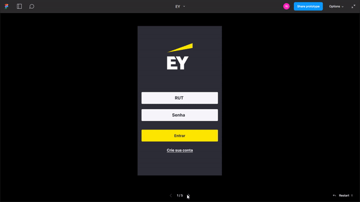

## 6. APRENDIZADOS

Foram quatro dias de trabalho bastante intensos, enriquecemos nossa experiência como desenvolvedoras tanto no campo técnico quanto sócio emocional.  Podemos ressaltar como pontos chave, a nossa organização como Squad, a nossa definição e cumprimento dos acordos formalizados como equipe os quais foram praticados do início ao fim por todas as integrantes e mantivemos uma excelente comunicação durante todo o momento. Todo o combinado e integração foi realizado em prol da fluidez, empatia e apoio mútuo. Também pudemos aprimorar os aprendizados obtidos durante o bootcamp intensivo de 6 meses da _*[Laboratoria](https://www.laboratoria.la/br)*_, podendo destacar as seguintes tecnologias e ferramentas utilizadas:

### 6.1 TECNOLOGIAS E FERRAMENTAS UTILIZADAS

- **Planejamento: [Trello](https://trello.com/b/pDCrPOah/3ey-talentfest)**
- **Protótipos: [Figma](https://www.figma.com/file/Xuz6uKFRIwaeuvmBPlt7nY/EY?node-id=0%3A1)**
- **HTML5** 
- **CSS3**     
- **JavaScript** 
- **Slack**     
- **React** 
- **JSX** 
- **Node JS**      
- **Jest** 
- **Firebase** 
- **Git** 
- **GitHub** & **GitHubProjects** 
- **Visual Studio Code** 

## 7. DESENVOLVEDORAS DO PROJETO

<table>
  <tr>
    <td align="center">
      <a href="https://github.com/adrianatwatanabe">
           
  
          <b>Adriana Watanabe</b>
        
      </a>
    </td>
    <td align="center">
      <a href="https://github.com/nannayusuf">
   
             
          <b>Helena Gonçalves</b>
        
      </a>
    </td>
    <td align="center">
      <a href="https://github.com/Gregisa">
           
  
          <b>Isabela Gregoraci</b>
        
      </a>
    </td>
  </tr>
 <tr>
  <td align="center">
        <a href="https://github.com/JessikaMirella">
             
    
            <b>Jessika Mirella</b>
          
        </a>
      </td>
      <td align="center">
        <a href="https://github.com/natalieiss">
             
    
            <b>Natalie Silva</b>
          
        </a>
    </td>
    <td align="center">
      <a href="https://github.com/moreirathais">
           
  
          <b>Thais Bonalume</b>
        
      </a>
    </td>
</table>

---
