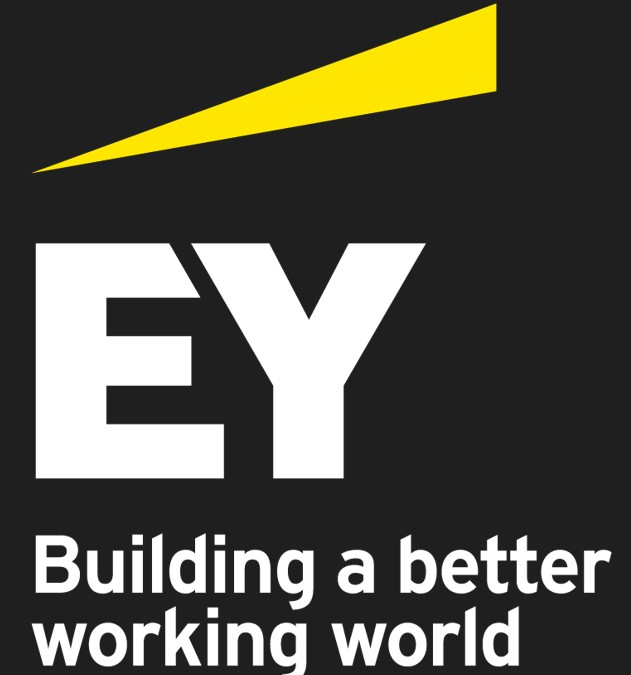
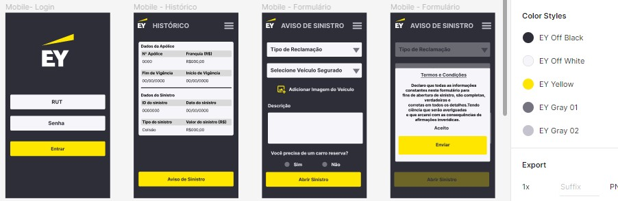
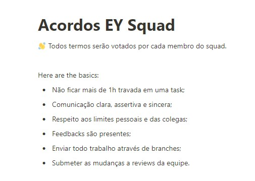

# Talent Fest Laboratoria SP - Desafio EY

## Índice

- [1. Introdução](#1-Introdução)
- [2. Resumo do Projeto](#2-Resumo-do-projeto)
- [3. Futuro do Projeto](#3-Futuro-do-Projeto)
- [4. Implementando melhorias que facilitem o acesso ao canal de atendimento](#Implementando-melhorias)
- [5.Fluxogramas](#5-Fluxogramas)
- [6.Protótipo e testes de usabilidade](#6-protótipo-e-testes-de-usabilidade)
- [7. Aprendizados](#9-Aprendizados)
- [8.Tecnologias e Ferramentas Utilizadas](#10-Tecnologias-e-ferramentas-utilizadas)
- [9. Desenvolvedoras](#11-desenvolvedoras)

## 1. INTRODUÇÃO

Projeto desenvolvido no bootcamp de front-end da Laboratoria para o evento denominado Talent Fest. Nosso desafio foi proposto pela empresa EY e neste projeto desenvolvemos uma aplicação web na modalidade desktop _responsivo_ (_mobile_) que ofereça aos clientes de uma seguradora de automóveis, uma alternativa fácil e rápida para abertura de sinistros.
Neste desafio tivemos que criar um banco de dados de back-end do zero e para isso optamos por depositar as coleções do nosso banco de dados no FireStore do Google Firebase, um BaaS (back-end as service).

---
## 2. RESUMO DO PROJETO

O aplicativo da EY Seguros oferece uma forma rápida e fácil para gerenciar/criar sinistros. Nele é possível que o cliente acesse seu histórico e efetue a criação de um sinistro. Para que o cliente consiga realizar a abertura de um sinistro é necessário que preencha o formulário, acrescente uma foto do veículo e aceite os termos e condições da seguradora.
Neste desafio, para iniciar a criação da aplicação, foram fornecidas três histórias de usuário:

## Caminho Feliz (História de Usuário 1)

## Caminho Infeliz 1 (História de Usuário 2)

## Caminho Infeliz 2 (História de Usuário 3)

Clique [aqui](https://natalieiss.github.io/Terceiro-Projeto-Social-Network) para conferir o resultado da aplicação. 

Por se tratar de um MVP na versão V.1.0.0 (versão beta), a função de login e cadastro não estará disponível para o público geral, apenas para os desenvolvedores. Esta função será disponibilizada na versão V.2.0.0.

---
## 3. FUTURO DO PROJETO

Para as próximas implementações (v2.0) iremos melhorar a segurança de nossos usuários acrescentando uma Política de Privacidade e Cookies, haverá um termo de usuário que deverá ser aceito no momento do cadastro afim de atender as determinações legais contidas na Lei Geral de Proteção de Dados Pessoais(LGPD).
Esta projeto também será refatorado. Será aprimorada a responsividade para os tablets e celulares. Serão implementadas melhorias na estilização do CSS.
Apesar das cores disponibilizadas pela EY para padronização da aplicação já serem acessíveis para daltônicos, acreditamos que podemos melhorar a experiência desses usuários oferecendo a eles um botão na parte inferior direita das páginas que possibilitará a troca automática das cores utilizadas na aplicação para um melhor contraste. Pretendemos implementar essa funcionalidade já na proxima versão.
Também serão implementados novos testes assíncronos e unitários.
Acrescentaremos também novos recursos para melhorar a acessibilidade na aplicação.
Ainda, pensando em solucionar as chamadas _"dores dos usuários"_ acrescentaremos um canal de atendimento por chat no intuito de atender as expectativas indicadas pelos nossos possíveis usuários durante o preenchimento da nossa pesquisa (https://docs.google.com/forms/d/e/1FAIpQLSeiVY99B4Z_S7eQhYpNtOCx5lCFf1kwg6RUugQ7jcXlfO2I0g/viewform?usp=sf_link).

---

## 4. IMPLEMENTANDO MELHORIAS QUE FACILITEM O ACESSO AO CANAL DE ATENDIMENTO

Tentamos pensar diversas situações que nossos usuários pudessem estar passando no momento da abertura de um sinistro. Imagine você, usuário, localizado no meio de uma BR, sem sinal de wi-fi, precisando solicitar um reboque (que a sua seguradora oferece) para o seu carro que colidiu com outro. O usuário, no momento de um desespero, precisa de uma aplicação que lhe facilite o contato com o seu prestador de serviços independente do meio utilizado. Desta forma, pensando em aprimorar a experiência de nossos usuários bem como facilitar o contato entre prestador de serviços e cliente decidimos disponibilizar, em todo o ambiente da aplicação, os canais de atendimento telefônico da empresa. Para implementar essa funcionalidade, seguimos os passos a seguir mencionados.
## Desta forma, pensando em aprimorar a experiência do usuário, foi criada uma Proto Persona com as seguintes características:

## Realizamos uma breve [pesquisa](https://docs.google.com/forms/d/e/1FAIpQLSeiVY99B4Z_S7eQhYpNtOCx5lCFf1kwg6RUugQ7jcXlfO2I0g/viewform?usp=sf_link) de usuário para validarmos a proto persona. A pesquisa obteve a participação de 20 pessoas e forneceu os seguintes resultados:

## Através da pesquisa de usuário realizada foi criada uma história de usuário:

---

## 5. FLUXOGRAMAS
## Com base nas historias de usuário nós criamos os seguintes fluxogramas.

---
## 6. PROTÓTIPO E TESTES DE USABILIDADE

## Visualizamos uma aplicação que refletisse as cores marcantes da EY e tentamos replicar a mesma fonte utilizada por ela em suas aplicações e websites para tornar a experiência mais imersiva.

## Com o auxílio do Figma também criamos um protótipo interativo para ser utilizado nos testes iniciais de usabilidade sendo que obtivemos um feedback bastante positivo.

  

---

## 7. APRENDIZADOS

Foram quatro dias de trabalho bastante intensos, enriquecemos nossa experiência como desenvolvedoras tanto no campo técnico quanto sócio emocional.  Podemos ressaltar como pontos chave, a nossa organização como Squad, a nossa definição e cumprimento dos acordos formalizados como equipe os quais foram praticados do início ao fim por todas as integrantes e mantivemos uma excelente comunicação durante todo o momento. Todo o combinado e integração foi realizado em prol da fluidez, empatia e apoio mútuo.

Além disso, futuramente temos a intenção de modificar o nosso banco de dados tendo-se em vista que o firebase, apesar de fornecer uma segurança padrão aos usuários, possui funcionalidades limitadas para criação das coleções. 

---
## 8. TECNOLOGIAS E FERRAMENTAS UTILIZADAS

- **Planejamento: [Trello](https://trello.com/b/pDCrPOah/3ey-talentfest)**
- **Protótipos: [Figma](https://www.figma.com/file/Xuz6uKFRIwaeuvmBPlt7nY/EY?node-id=0%3A1)**
- **HTML5** 
- **CSS3**     
- **JavaScript** 
- **Slack**     
- **React** 
- **JSX** 
- **Node JS**      
- **Jest** 
- **Firebase** 
- **Git** 
- **GitHub** & **GitHubProjects** 
- **Visual Studio Code** 

---
## 9. DESENVOLVEDORAS DO PROJETO

<table>
  <tr>
    <td align="center">
      <a href="https://github.com/adrianatwatanabe">
           
  
          <b>Adriana Watanabe</b>
        
      </a>
    </td>
    <td align="center">
      <a href="https://github.com/nannayusuf">
   
             
          <b>Helena Gonçalves</b>
        
      </a>
    </td>
    <td align="center">
      <a href="https://github.com/Gregisa">
           
  
          <b>Isabela Gregoraci</b>
        
      </a>
    </td>
  </tr>
 <tr>
  <td align="center">
        <a href="https://github.com/JessikaMirella">
             
    
            <b>Jessika Mirella</b>
          
        </a>
      </td>
      <td align="center">
        <a href="https://github.com/natalieiss">
             
    
            <b>Natalie Silva</b>
          
        </a>
    </td>
    <td align="center">
      <a href="https://github.com/moreirathais">
           
  
          <b>Thais Moreira</b>
        
      </a>
    </td>
</table>

---
